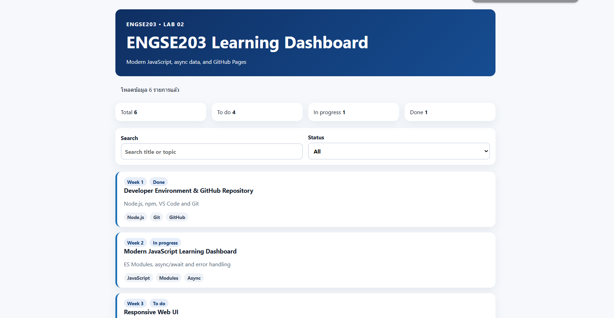

# ENGSE203 Learning Dashboard

> LAB 02 — Modern JavaScript, Modules & Async Data

## Student Information

- Student ID: `68543210048-3`
- Name: `Aungkane Sakunbundee`
- Operating system: `<Windows + WSL>`
- GitHub Pages URL: `https://aungkanr.github.io/engse203-lab02-68543210048-3/`

## Project Overview

ENGSE203 Learning Dashboard คือเว็บแอปพลิเคชันที่พัฒนาด้วย Modern JavaScript (ES Modules) สำหรับแสดงรายการงานเรียนรู้ (learning tasks) ของแต่ละสัปดาห์ในวิชา ENGSE203 โดยดึงข้อมูลแบบ asynchronous จากแหล่งข้อมูลภายในโปรเจกต์

ฟีเจอร์หลัก มี
- สรุปจำนวนงาน — แสดงจำนวนงานทั้งหมด และแยกตามสถานะ To do, In progress, Done
- ค้นหา (Search) — ค้นหางานจากชื่อหัวข้อได้แบบ real-time
- กรองตามสถานะ (Status filter) — เลือกดูงานตามสถานะผ่าน dropdown
- รายการงาน (Task list) — แต่ละงานแสดงสัปดาห์, สถานะ, ชื่อหัวข้อ, คำอธิบายสั้นๆ และ tag ที่เกี่ยวข้อง (เช่น Node.js, Git, React, SQLite เป็นต้น)
- โหลดข้อมูลแบบ Async — แสดงข้อความบอกจำนวนรายการที่โหลดสำเร็จ
- จัดการ Error — แสดงข้อความแจ้งเตือนที่เข้าใจง่ายเมื่อโหลดข้อมูลไม่สำเร็จ

## Installation and Run

```bash
npm install
npm run check
npm run dev
```

## Build and Preview

```bash
npm run build
npm run preview
```

## Test Evidence

- Normal state screenshot: 
- Error state screenshot (`?simulateError=1`): 

## Problems and Fixes

--------------------------------------------------------------------------------------------------------

Problem 1: รัน `npm run deploy` แล้วขึ้น `Missing script: "deploy"`

หลังจากเพิ่มบรรทัด `"deploy"` ลงในไฟล์ `package.json` แล้วรันคำสั่งทันที กลับขึ้น error ว่าไม่พบ script ดังกล่าว

วิธีแก้: พบว่ายังไม่ได้กด Save ไฟล์ `package.json` หลังแก้ไข  เมื่อกด `Ctrl+S` บันทึกไฟล์ก่อน แล้วรัน `npm run deploy` ใหม่ คำสั่งก็ทำงานได้สำเร็จและ deploy ขึ้น GitHub Pages ได้

---------------------------------------------------------------------------------------------------------

Problem 2: หน้าเว็บบน GitHub Pages ไม่โหลด CSS/JS 

เกิดจากค่า `base` ใน `vite.config.js` ไม่ตรงกับชื่อ repository บน GitHub Pages ทำให้ path ของไฟล์ที่ build ออกมาไม่ถูกต้อง

วิธีแก้: ตั้งค่า `base` ใน `vite.config.js` ให้ตรงกับชื่อ repo แบบเป๊ะๆ
```js
export default {
  base: '/engse203-lab02-68543210048-3/'
}
```
แล้ว build และ deploy ใหม่ ก็แสดงผลได้ถูกต้อง
--------------------------------------------------------------------------------------------------------------

## References & AI Assistance

- References used: `<list sources>`
- AI assistance used: `<describe question asked and what you changed/understood yourself>`